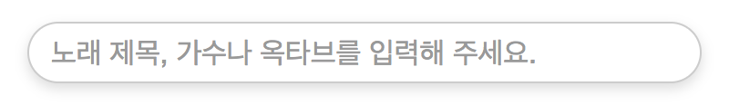
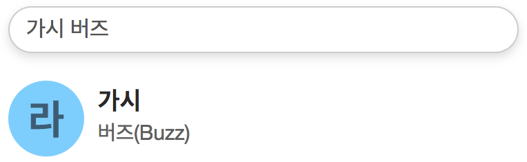
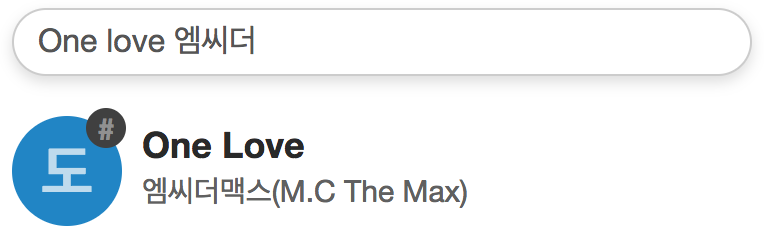

# 

## 사용방법
### 검색

옥타브, 음, 노래 제목과 가수를 순서와 상관없이 입력해주시면 됩니다.

##### ♯ 과 ♭ 검색은 아직 지원되지 않습니다.

#### 검색 규칙
- 옥타브는 "옥타브" 와 "옥" 모두 사용 가능합니다.
- 모든 부분 띄어쓰기는 생략 가능합니다.
- 노래 제목이나, 가수 이름이 영어로 되어있는 경우에는 검색시 맨 뒤에 붙여줘야 합니다.

        버즈 2옥 솔 (X)
        2옥타브 시 버즈 (O)
        넬 2옥타브 시 (X)
        3옥 넬 (O)

##### 이부분은 개선 예정입니다.

#### 검색 예시

    2옥라 버즈 (O)
    3옥타브 엠씨더맥스 (O)
    안녕나의사랑 (O)
    김경호 2옥 (O)
    버즈 가시 (X)
    고기먹고싶다 (X)

### 검색결과

옥타브는 색으로 표시되며, 왼쪽부터 순서대로 1, 2, 3, 4 옥타브를 나타냅니다.

#### 검색결과 예시

    이 결과는 "2옥타브 라"를 나타냅니다.

    이 결과는 "3옥타브 도♯"을 나타냅니다.