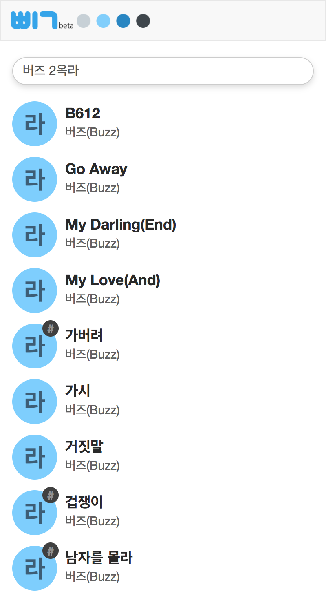

# 

##  이란

노래의 최고음을 검색할 수 있는 검색엔진 입니다.

## 사용방법
### 검색

옥타브, 음, 노래 제목과 가수를 순서와 상관없이 입력해주시면 됩니다.

##### ♯ 과 ♭ 검색은 아직 지원되지 않습니다.

#### 검색 규칙
- 옥타브는 "옥타브" 와 "옥" 모두 사용 가능합니다.

        3옥레 (O)
        3옥타브 레 (O)

- 모든 부분 띄어쓰기는 생략 가능합니다.

        금지된사랑 (O)
        금지된 사랑 (O)

- 노래 제목이나 이름이 영어인 경우는 한글과 영어 모두 검색 가능합니다.

        Nell Stay (O)
        넬 Stay (O)

- 검색 항목의 순서는 어떻게 입력해도 무관합니다.

        테이 같은베개 (O)
        같은베개 테이 (O)

#### 검색 예시

    2옥라 버즈
    Buzz가시
    3옥타브 엠씨더맥스
    안녕나의사랑
    김경호 2옥

### 검색결과

옥타브는 색으로 표시되며, 왼쪽부터 순서대로 1, 2, 3, 4 옥타브를 나타냅니다.

#### 검색결과 예시

    이 결과는 "2옥타브 라"를 나타냅니다.

    이 결과는 "3옥타브 도♯"을 나타냅니다.

## 스크린샷
