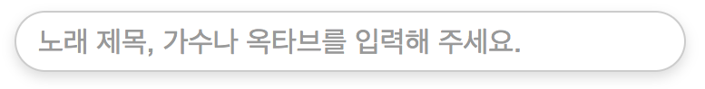

# 

## 사용방법

### 검색
옥타브, 음, 노래 제목과 가수를 순서와 상관없이 입력해주시면 됩니다.

#### 검색 규칙
- 옥타브는 "옥타브" 와 "옥" 모두 사용 가능합니다.
- 모든 부분 띄어쓰기는 생략 가능합니다.
- 노래 제목이나, 가수 이름에 영어가 들어가는 경우는 검색시 맨 뒤에 붙여줘야 합니다.

        버즈 2옥 솔 (X)
        2옥타브 시 버즈 (O)

#### 검색 예시

    2옥라 버즈 (O)
    3옥타브 엠씨더맥스 (O)
    안녕나의사랑 (O)
    2옥타브 (O)
    김경호 2옥 (O)